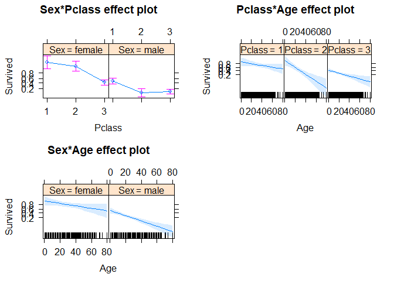
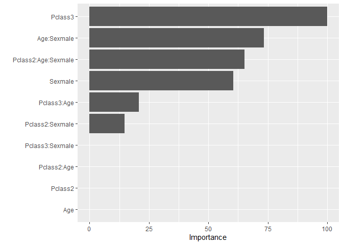
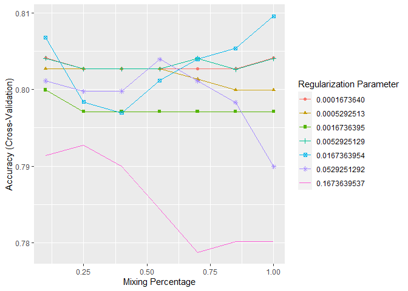

Build a logistic regression model
---------------------------------

### Titanic dataset description

The `titanic` library in R has 4 different datasets, they are
**titanic\_train**, **titanic\_test**, **titanic\_gender\_model**, and
**titanic\_gender\_class\_model**. They describe the survival status of
individual passengers on the Titanic. The variable description can be
found below:

1.  Pclass: Passenger Class (1 = 1st, 2 = 2nd, 3 = 3rd)

2.  survived: Survival (0 = No; 1 = Yes)

3.  name: Name

4.  sex: Sex

5.  age: Age

6.  sibsp: Number of Siblings/Spouses Aboard

7.  parch: Number of Parents/Children Aboard

8.  ticket: Ticket Number

9.  fare: Passenger Fare (British pound)

10. cabin: Cabin

11. embarked: Port of Embarkation

    (C = Cherbourg; Q = Queenstown; S = Southampton)

12. boat: Lifeboat

13. body: Body Identification Number

14. home.dest: Home/Destination

### Data preprocessing

We use the `titanic` library to load the data.

``` r
library(titanic)
library(tidyverse)
data("titanic_train")
data("titanic_test")
str(titanic_train)
```

    ## 'data.frame':    891 obs. of  12 variables:
    ##  $ PassengerId: int  1 2 3 4 5 6 7 8 9 10 ...
    ##  $ Survived   : int  0 1 1 1 0 0 0 0 1 1 ...
    ##  $ Pclass     : int  3 1 3 1 3 3 1 3 3 2 ...
    ##  $ Name       : chr  "Braund, Mr. Owen Harris" "Cumings, Mrs. John Bradley (Florence Briggs Thayer)" "Heikkinen, Miss. Laina" "Futrelle, Mrs. Jacques Heath (Lily May Peel)" ...
    ##  $ Sex        : chr  "male" "female" "female" "female" ...
    ##  $ Age        : num  22 38 26 35 35 NA 54 2 27 14 ...
    ##  $ SibSp      : int  1 1 0 1 0 0 0 3 0 1 ...
    ##  $ Parch      : int  0 0 0 0 0 0 0 1 2 0 ...
    ##  $ Ticket     : chr  "A/5 21171" "PC 17599" "STON/O2. 3101282" "113803" ...
    ##  $ Fare       : num  7.25 71.28 7.92 53.1 8.05 ...
    ##  $ Cabin      : chr  "" "C85" "" "C123" ...
    ##  $ Embarked   : chr  "S" "C" "S" "S" ...

Alternatively, you can input the data by downloading it from my Github
repo and reading it into R with library `readr`.

``` r
library(readr)
titanic_train <- read_csv("data/titanic_train.csv")
```

    ## 
    ## -- Column specification --------------------------------------------------------
    ## cols(
    ##   Survived = col_double(),
    ##   Pclass = col_double(),
    ##   Age = col_double(),
    ##   Sex = col_character()
    ## )

``` r
titanic_test <- read_csv("data/titanic_test.csv")
```

    ## 
    ## -- Column specification --------------------------------------------------------
    ## cols(
    ##   Survived = col_double(),
    ##   Pclass = col_double(),
    ##   Age = col_double(),
    ##   Sex = col_character()
    ## )

Let’s clean the dataset by extracting four variables (`Survived`,
`Pclass`, `Age`,`Sex`) and change the variable type to `factor` for
`Survived` and `Pclass`. Since the data has been pre-processed by other
people and is pretty clean, we don’t do much thing here. Usually, you
will have more work to do for your raw data.

``` r
data("titanic_train")
data("titanic_test")

# clean the data
titanic_train <- titanic_train %>% 
  select(Survived, Pclass, Age, Sex) %>% 
  mutate(Survived = as.factor(Survived), Pclass = as.factor(Pclass)) %>%  na.omit()

titanic_test <- titanic_test %>% 
  select(Pclass, Age, Sex) %>% 
  mutate(Pclass = as.factor(Pclass)) %>% na.omit()
```

Let’s do preliminary descriptive analysis using `ggpairs` function in
`GGally` library. The function will generate a matrix of selected
variables.


### Modeling

Then, let’s fit a logistic regression model to it and use `summary`
function to see the model details.

``` r
logistic <- glm(Survived ~ Pclass + Age + Sex, family = "binomial", data = titanic_train)
summary(logistic)
```

    ## 
    ## Call:
    ## glm(formula = Survived ~ Pclass + Age + Sex, family = "binomial", 
    ##     data = titanic_train)
    ## 
    ## Deviance Residuals: 
    ##     Min       1Q   Median       3Q      Max  
    ## -2.7303  -0.6780  -0.3953   0.6485   2.4657  
    ## 
    ## Coefficients:
    ##              Estimate Std. Error z value Pr(>|z|)    
    ## (Intercept)  3.777013   0.401123   9.416  < 2e-16 ***
    ## Pclass2     -1.309799   0.278066  -4.710 2.47e-06 ***
    ## Pclass3     -2.580625   0.281442  -9.169  < 2e-16 ***
    ## Age         -0.036985   0.007656  -4.831 1.36e-06 ***
    ## Sexmale     -2.522781   0.207391 -12.164  < 2e-16 ***
    ## ---
    ## Signif. codes:  0 '***' 0.001 '**' 0.01 '*' 0.05 '.' 0.1 ' ' 1
    ## 
    ## (Dispersion parameter for binomial family taken to be 1)
    ## 
    ##     Null deviance: 964.52  on 713  degrees of freedom
    ## Residual deviance: 647.28  on 709  degrees of freedom
    ## AIC: 657.28
    ## 
    ## Number of Fisher Scoring iterations: 5

The model looks good and all selected variables are significant, we want
to explore and see whether there are better models. Let’s try
interaction terms.

#### Interaction terms

An interaction occurs when an independent variable has a different
effect on the outcome depending on the values of another independent
variable. We want to check `Age` and `Pclass` first because typically
older may earn more money and thus, buy expensive tickets.

``` r
mod_inte <- glm(Survived ~ Pclass + Age + Sex + Age*Pclass, family = "binomial", data = titanic_train)
summary(mod_inte)
```

    ## 
    ## Call:
    ## glm(formula = Survived ~ Pclass + Age + Sex + Age * Pclass, family = "binomial", 
    ##     data = titanic_train)
    ## 
    ## Deviance Residuals: 
    ##     Min       1Q   Median       3Q      Max  
    ## -2.6515  -0.6591  -0.4006   0.6297   2.4209  
    ## 
    ## Coefficients:
    ##               Estimate Std. Error z value Pr(>|z|)    
    ## (Intercept)  3.546e+00  5.700e-01   6.222 4.92e-10 ***
    ## Pclass2     -6.092e-01  7.153e-01  -0.852 0.394407    
    ## Pclass3     -2.478e+00  6.387e-01  -3.880 0.000105 ***
    ## Age         -3.067e-02  1.284e-02  -2.387 0.016964 *  
    ## Sexmale     -2.553e+00  2.100e-01 -12.156  < 2e-16 ***
    ## Pclass2:Age -2.191e-02  1.949e-02  -1.124 0.261017    
    ## Pclass3:Age -3.707e-05  1.796e-02  -0.002 0.998353    
    ## ---
    ## Signif. codes:  0 '***' 0.001 '**' 0.01 '*' 0.05 '.' 0.1 ' ' 1
    ## 
    ## (Dispersion parameter for binomial family taken to be 1)
    ## 
    ##     Null deviance: 964.52  on 713  degrees of freedom
    ## Residual deviance: 645.63  on 707  degrees of freedom
    ## AIC: 659.63
    ## 
    ## Number of Fisher Scoring iterations: 5

The result doesn’t show any trace. Then, let’s do a full interaction
model and try every possible combination.

``` r
mod_inte <- glm(Survived ~ Pclass*Age*Sex, family = "binomial", data = titanic_train)
summary(mod_inte)
```

    ## 
    ## Call:
    ## glm(formula = Survived ~ Pclass * Age * Sex, family = "binomial", 
    ##     data = titanic_train)
    ## 
    ## Deviance Residuals: 
    ##     Min       1Q   Median       3Q      Max  
    ## -2.9892  -0.6291  -0.4238   0.3812   3.3852  
    ## 
    ## Coefficients:
    ##                     Estimate Std. Error z value Pr(>|z|)  
    ## (Intercept)          1.57559    1.45292   1.084   0.2782  
    ## Pclass2              2.48900    1.97071   1.263   0.2066  
    ## Pclass3             -1.10790    1.50839  -0.734   0.4626  
    ## Age                  0.05761    0.05095   1.131   0.2582  
    ## Sexmale             -0.40014    1.58512  -0.252   0.8007  
    ## Pclass2:Age         -0.10862    0.06224  -1.745   0.0809 .
    ## Pclass3:Age         -0.08664    0.05356  -1.617   0.1058  
    ## Pclass2:Sexmale     -2.75606    2.17646  -1.266   0.2054  
    ## Pclass3:Sexmale     -0.87304    1.68742  -0.517   0.6049  
    ## Age:Sexmale         -0.09714    0.05314  -1.828   0.0675 .
    ## Pclass2:Age:Sexmale  0.04114    0.06996   0.588   0.5565  
    ## Pclass3:Age:Sexmale  0.08859    0.05795   1.529   0.1263  
    ## ---
    ## Signif. codes:  0 '***' 0.001 '**' 0.01 '*' 0.05 '.' 0.1 ' ' 1
    ## 
    ## (Dispersion parameter for binomial family taken to be 1)
    ## 
    ##     Null deviance: 964.52  on 713  degrees of freedom
    ## Residual deviance: 601.33  on 702  degrees of freedom
    ## AIC: 625.33
    ## 
    ## Number of Fisher Scoring iterations: 6

It looks good though. Why don’t we let the algorithm do the model
selection for us? I will use **Stepwise Algorithm** to do that job.
First, I will create two models as the starting point for the algorithm.

-   null model means no variable is in the model.

-   full model means the model contains all variables and possible
    interaction terms.

``` r
# model with nothing
nullmod <- glm(Survived ~ 1, family = "binomial", data = titanic_train)

# model with all possible interaction term
fullmod <- glm(Survived ~ Pclass*Age*Sex, family = "binomial", data = titanic_train)

summary(fullmod)
```

    ## 
    ## Call:
    ## glm(formula = Survived ~ Pclass * Age * Sex, family = "binomial", 
    ##     data = titanic_train)
    ## 
    ## Deviance Residuals: 
    ##     Min       1Q   Median       3Q      Max  
    ## -2.9892  -0.6291  -0.4238   0.3812   3.3852  
    ## 
    ## Coefficients:
    ##                     Estimate Std. Error z value Pr(>|z|)  
    ## (Intercept)          1.57559    1.45292   1.084   0.2782  
    ## Pclass2              2.48900    1.97071   1.263   0.2066  
    ## Pclass3             -1.10790    1.50839  -0.734   0.4626  
    ## Age                  0.05761    0.05095   1.131   0.2582  
    ## Sexmale             -0.40014    1.58512  -0.252   0.8007  
    ## Pclass2:Age         -0.10862    0.06224  -1.745   0.0809 .
    ## Pclass3:Age         -0.08664    0.05356  -1.617   0.1058  
    ## Pclass2:Sexmale     -2.75606    2.17646  -1.266   0.2054  
    ## Pclass3:Sexmale     -0.87304    1.68742  -0.517   0.6049  
    ## Age:Sexmale         -0.09714    0.05314  -1.828   0.0675 .
    ## Pclass2:Age:Sexmale  0.04114    0.06996   0.588   0.5565  
    ## Pclass3:Age:Sexmale  0.08859    0.05795   1.529   0.1263  
    ## ---
    ## Signif. codes:  0 '***' 0.001 '**' 0.01 '*' 0.05 '.' 0.1 ' ' 1
    ## 
    ## (Dispersion parameter for binomial family taken to be 1)
    ## 
    ##     Null deviance: 964.52  on 713  degrees of freedom
    ## Residual deviance: 601.33  on 702  degrees of freedom
    ## AIC: 625.33
    ## 
    ## Number of Fisher Scoring iterations: 6

The are two ways for the **Stepwise Algorithm** to work, one is backward
selection and the other is forward selection. Both will give you the
same result though. Let me try backward selection first.

``` r
# backward Stepwise algorithm AIC
bwd <- step(fullmod, direction = "backward")
```

    ## Start:  AIC=625.33
    ## Survived ~ Pclass * Age * Sex
    ## 
    ##                  Df Deviance    AIC
    ## - Pclass:Age:Sex  2   604.34 624.34
    ## <none>                601.33 625.33
    ## 
    ## Step:  AIC=624.34
    ## Survived ~ Pclass + Age + Sex + Pclass:Age + Pclass:Sex + Age:Sex
    ## 
    ##              Df Deviance    AIC
    ## <none>            604.34 624.34
    ## - Age:Sex     1   606.92 624.92
    ## - Pclass:Age  2   611.11 627.11
    ## - Pclass:Sex  2   631.83 647.83

``` r
# show the model backward chose
summary(bwd)
```

    ## 
    ## Call:
    ## glm(formula = Survived ~ Pclass + Age + Sex + Pclass:Age + Pclass:Sex + 
    ##     Age:Sex, family = "binomial", data = titanic_train)
    ## 
    ## Deviance Residuals: 
    ##     Min       1Q   Median       3Q      Max  
    ## -2.6219  -0.6405  -0.3971   0.3376   3.2713  
    ## 
    ## Coefficients:
    ##                 Estimate Std. Error z value Pr(>|z|)    
    ## (Intercept)      3.41025    0.96744   3.525 0.000423 ***
    ## Pclass2          1.24535    1.20069   1.037 0.299644    
    ## Pclass3         -3.17259    0.91924  -3.451 0.000558 ***
    ## Age             -0.00293    0.02188  -0.134 0.893489    
    ## Sexmale         -2.48345    0.91908  -2.702 0.006890 ** 
    ## Pclass2:Age     -0.06445    0.02621  -2.458 0.013954 *  
    ## Pclass3:Age     -0.01534    0.01972  -0.778 0.436844    
    ## Pclass2:Sexmale -1.45924    0.89989  -1.622 0.104892    
    ## Pclass3:Sexmale  1.68959    0.73022   2.314 0.020678 *  
    ## Age:Sexmale     -0.03034    0.01887  -1.608 0.107767    
    ## ---
    ## Signif. codes:  0 '***' 0.001 '**' 0.01 '*' 0.05 '.' 0.1 ' ' 1
    ## 
    ## (Dispersion parameter for binomial family taken to be 1)
    ## 
    ##     Null deviance: 964.52  on 713  degrees of freedom
    ## Residual deviance: 604.34  on 704  degrees of freedom
    ## AIC: 624.34
    ## 
    ## Number of Fisher Scoring iterations: 6

Then, let’s try forward selection.

``` r
# forward stepwise algorithm
fwd <- step(nullmod, scope = list(upper = fullmod), direction = "forward")
```

    ## Start:  AIC=966.52
    ## Survived ~ 1
    ## 
    ##          Df Deviance    AIC
    ## + Sex     1   750.70 754.70
    ## + Pclass  2   869.81 875.81
    ## + Age     1   960.23 964.23
    ## <none>        964.52 966.52
    ## 
    ## Step:  AIC=754.7
    ## Survived ~ Sex
    ## 
    ##          Df Deviance    AIC
    ## + Pclass  2   672.43 680.43
    ## <none>        750.70 754.70
    ## + Age     1   749.96 755.96
    ## 
    ## Step:  AIC=680.43
    ## Survived ~ Sex + Pclass
    ## 
    ##              Df Deviance    AIC
    ## + Pclass:Sex  2   642.28 654.28
    ## + Age         1   647.28 657.28
    ## <none>            672.43 680.43
    ## 
    ## Step:  AIC=654.28
    ## Survived ~ Sex + Pclass + Sex:Pclass
    ## 
    ##        Df Deviance    AIC
    ## + Age   1   613.43 627.43
    ## <none>      642.28 654.28
    ## 
    ## Step:  AIC=627.43
    ## Survived ~ Sex + Pclass + Age + Sex:Pclass
    ## 
    ##              Df Deviance    AIC
    ## + Pclass:Age  2   606.92 624.92
    ## + Age:Sex     1   611.11 627.11
    ## <none>            613.43 627.43
    ## 
    ## Step:  AIC=624.92
    ## Survived ~ Sex + Pclass + Age + Sex:Pclass + Pclass:Age
    ## 
    ##           Df Deviance    AIC
    ## + Age:Sex  1   604.34 624.34
    ## <none>         606.92 624.92
    ## 
    ## Step:  AIC=624.34
    ## Survived ~ Sex + Pclass + Age + Sex:Pclass + Pclass:Age + Sex:Age
    ## 
    ##                  Df Deviance    AIC
    ## <none>                604.34 624.34
    ## + Pclass:Age:Sex  2   601.33 625.33

``` r
# show the model forward chose
summary(fwd)
```

    ## 
    ## Call:
    ## glm(formula = Survived ~ Sex + Pclass + Age + Sex:Pclass + Pclass:Age + 
    ##     Sex:Age, family = "binomial", data = titanic_train)
    ## 
    ## Deviance Residuals: 
    ##     Min       1Q   Median       3Q      Max  
    ## -2.6219  -0.6405  -0.3971   0.3376   3.2713  
    ## 
    ## Coefficients:
    ##                 Estimate Std. Error z value Pr(>|z|)    
    ## (Intercept)      3.41025    0.96744   3.525 0.000423 ***
    ## Sexmale         -2.48345    0.91908  -2.702 0.006890 ** 
    ## Pclass2          1.24535    1.20069   1.037 0.299644    
    ## Pclass3         -3.17259    0.91924  -3.451 0.000558 ***
    ## Age             -0.00293    0.02188  -0.134 0.893489    
    ## Sexmale:Pclass2 -1.45924    0.89989  -1.622 0.104892    
    ## Sexmale:Pclass3  1.68959    0.73022   2.314 0.020678 *  
    ## Pclass2:Age     -0.06445    0.02621  -2.458 0.013954 *  
    ## Pclass3:Age     -0.01534    0.01972  -0.778 0.436844    
    ## Sexmale:Age     -0.03034    0.01887  -1.608 0.107767    
    ## ---
    ## Signif. codes:  0 '***' 0.001 '**' 0.01 '*' 0.05 '.' 0.1 ' ' 1
    ## 
    ## (Dispersion parameter for binomial family taken to be 1)
    ## 
    ##     Null deviance: 964.52  on 713  degrees of freedom
    ## Residual deviance: 604.34  on 704  degrees of freedom
    ## AIC: 624.34
    ## 
    ## Number of Fisher Scoring iterations: 6

The most convenient way is to use the Stepwise regression.

    ## Start:  AIC=966.52
    ## Survived ~ 1
    ## 
    ##          Df Deviance    AIC
    ## + Sex     1   750.70 754.70
    ## + Pclass  2   869.81 875.81
    ## + Age     1   960.23 964.23
    ## <none>        964.52 966.52
    ## 
    ## Step:  AIC=754.7
    ## Survived ~ Sex
    ## 
    ##          Df Deviance    AIC
    ## + Pclass  2   672.43 680.43
    ## <none>        750.70 754.70
    ## + Age     1   749.96 755.96
    ## - Sex     1   964.52 966.52
    ## 
    ## Step:  AIC=680.43
    ## Survived ~ Sex + Pclass
    ## 
    ##              Df Deviance    AIC
    ## + Pclass:Sex  2   642.28 654.28
    ## + Age         1   647.28 657.28
    ## <none>            672.43 680.43
    ## - Pclass      2   750.70 754.70
    ## - Sex         1   869.81 875.81
    ## 
    ## Step:  AIC=654.28
    ## Survived ~ Sex + Pclass + Sex:Pclass
    ## 
    ##              Df Deviance    AIC
    ## + Age         1   613.43 627.43
    ## <none>            642.28 654.28
    ## - Sex:Pclass  2   672.43 680.43
    ## 
    ## Step:  AIC=627.43
    ## Survived ~ Sex + Pclass + Age + Sex:Pclass
    ## 
    ##              Df Deviance    AIC
    ## + Pclass:Age  2   606.92 624.92
    ## + Age:Sex     1   611.11 627.11
    ## <none>            613.43 627.43
    ## - Age         1   642.28 654.28
    ## - Sex:Pclass  2   647.28 657.28
    ## 
    ## Step:  AIC=624.92
    ## Survived ~ Sex + Pclass + Age + Sex:Pclass + Pclass:Age
    ## 
    ##              Df Deviance    AIC
    ## + Age:Sex     1   604.34 624.34
    ## <none>            606.92 624.92
    ## - Pclass:Age  2   613.43 627.43
    ## - Sex:Pclass  2   645.63 659.63
    ## 
    ## Step:  AIC=624.34
    ## Survived ~ Sex + Pclass + Age + Sex:Pclass + Pclass:Age + Sex:Age
    ## 
    ##                  Df Deviance    AIC
    ## <none>                604.34 624.34
    ## - Sex:Age         1   606.92 624.92
    ## + Pclass:Age:Sex  2   601.33 625.33
    ## - Pclass:Age      2   611.11 627.11
    ## - Sex:Pclass      2   631.83 647.83

    ## 
    ## Call:
    ## glm(formula = Survived ~ Sex + Pclass + Age + Sex:Pclass + Pclass:Age + 
    ##     Sex:Age, family = "binomial", data = titanic_train)
    ## 
    ## Deviance Residuals: 
    ##     Min       1Q   Median       3Q      Max  
    ## -2.6219  -0.6405  -0.3971   0.3376   3.2713  
    ## 
    ## Coefficients:
    ##                 Estimate Std. Error z value Pr(>|z|)    
    ## (Intercept)      3.41025    0.96744   3.525 0.000423 ***
    ## Sexmale         -2.48345    0.91908  -2.702 0.006890 ** 
    ## Pclass2          1.24535    1.20069   1.037 0.299644    
    ## Pclass3         -3.17259    0.91924  -3.451 0.000558 ***
    ## Age             -0.00293    0.02188  -0.134 0.893489    
    ## Sexmale:Pclass2 -1.45924    0.89989  -1.622 0.104892    
    ## Sexmale:Pclass3  1.68959    0.73022   2.314 0.020678 *  
    ## Pclass2:Age     -0.06445    0.02621  -2.458 0.013954 *  
    ## Pclass3:Age     -0.01534    0.01972  -0.778 0.436844    
    ## Sexmale:Age     -0.03034    0.01887  -1.608 0.107767    
    ## ---
    ## Signif. codes:  0 '***' 0.001 '**' 0.01 '*' 0.05 '.' 0.1 ' ' 1
    ## 
    ## (Dispersion parameter for binomial family taken to be 1)
    ## 
    ##     Null deviance: 964.52  on 713  degrees of freedom
    ## Residual deviance: 604.34  on 704  degrees of freedom
    ## AIC: 624.34
    ## 
    ## Number of Fisher Scoring iterations: 6

Let’s visualize the effects of the variables then.

``` r
plot(effects::allEffects(both))
```



Build a regularized logistic regression
---------------------------------------

We use the `glmnet` library to build the regularized logistic regression
(elastic nets) and tune the hyperparameter using `caret`. As we want to
predict whether a passenger survived (1 = surivied, 0 = didn’t) using
predictors (age, sex, class). What we will do next:

-   Train a model using training set

-   Predict survival in test set

``` r
library(glmnet)
```

    ## Loading required package: Matrix

    ## 
    ## Attaching package: 'Matrix'

    ## The following objects are masked from 'package:tidyr':
    ## 
    ##     expand, pack, unpack

    ## Loaded glmnet 4.1-1

``` r
library(caret)
```

    ## Loading required package: lattice

    ## 
    ## Attaching package: 'caret'

    ## The following object is masked from 'package:purrr':
    ## 
    ##     lift

``` r
reg_logistic <- caret::train(
  Survived ~ Pclass*Age*Sex,
  data = titanic_train, 
  preProc = c("center", "scale", "zv"),
  method = "glmnet",
  family = "binomial",
  trControl = trainControl(
    method = "cv", number = 10
  ),
  tuneLength = 7
)
```

-   `preProcess` argument specifies how you preprocess the data before
    piping it into the model. Use `?preProcess` see pre-processing
    options of training data.

-   Use `?trainControl` see training options. We use 10-fold cross
    validation.

-   `tuneLength` specifies the regularization parameter `alpha`

Let’s then take a look at the training model and see the hypeparameter
for the best tune model generated from 10-fold cross validation.

``` r
summary(reg_logistic)
```

    ##             Length Class      Mode     
    ## a0           78    -none-     numeric  
    ## beta        858    dgCMatrix  S4       
    ## df           78    -none-     numeric  
    ## dim           2    -none-     numeric  
    ## lambda       78    -none-     numeric  
    ## dev.ratio    78    -none-     numeric  
    ## nulldev       1    -none-     numeric  
    ## npasses       1    -none-     numeric  
    ## jerr          1    -none-     numeric  
    ## offset        1    -none-     logical  
    ## classnames    2    -none-     character
    ## call          5    -none-     call     
    ## nobs          1    -none-     numeric  
    ## lambdaOpt     1    -none-     numeric  
    ## xNames       11    -none-     character
    ## problemType   1    -none-     character
    ## tuneValue     2    data.frame list     
    ## obsLevels     2    -none-     character
    ## param         1    -none-     list

``` r
reg_logistic$bestTune
```

    ##    alpha    lambda
    ## 47     1 0.0167364

We can also view the variable importance using `vip` function. `Pclass3`
is the most important among all the variables.

``` r
# plotting variable importance
vip::vip(reg_logistic)
```


To evaluate the model performance, we use confusion matrix because we
are dealing with a classification problem.

-   The upper left and bottom right cells show the number of correct
    classifications.

-   The upper right and bottom left cells show the number of wrong
    classifications.

-   Accuracy means how many classifications are correctly predicted in
    total and is calculated using (TP + TN)/(TP+FP+FN+TN)

    -   TP(true positive): upper left cell

    -   TN(true negative): bottom right cell

    -   FP(false positive): upper right cell

    -   FN(false negative): bottom left cell

-   Specificity means the proportion of 0s that are correctly classified
    and is calculated using TN/(TN+FP)

-   Sensitivity means the proportion of actual 1s that are classified
    correctly and is calculated using TP/(TP+FN)

``` r
# find average bootstrap accuracy
confusionMatrix(reg_logistic)
```

    ## Cross-Validated (10 fold) Confusion Matrix 
    ## 
    ## (entries are percentual average cell counts across resamples)
    ##  
    ##           Reference
    ## Prediction    0    1
    ##          0 51.8 11.5
    ##          1  7.6 29.1
    ##                             
    ##  Accuracy (average) : 0.8095

As we can see, the accuracy is *0.8053*. Accuracy estimates how often I
classify right or the percentage of times that my model predicts
correctly. I estimate that my regularized logistic regression predicts
correctly 80% of the times.

Let’s use the trained model to predict on the test set and see the
predicted result. The output table shows the probability of each
possible result (1 = Survivied, 0 = didn’t).

``` r
titanic_test <- titanic_test %>% mutate(
  preds_reg = predict(reg_logistic, newdata = titanic_test, type = "prob"),
)
head(titanic_test$preds_reg)
```

    ##           0          1
    ## 1 0.8954186 0.10458142
    ## 2 0.5505312 0.44946882
    ## 3 0.9834028 0.01659716
    ## 4 0.8620376 0.13796236
    ## 5 0.4829268 0.51707323
    ## 6 0.7835211 0.21647886

We can also visualize the parameter tuning for regularized regression.

``` r
ggplot(reg_logistic)
```


